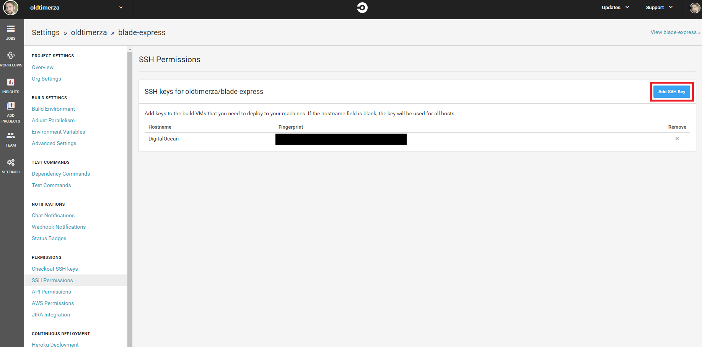

##Introduction

One of the best ways to get a project up and running ,and making it easy to have the project be live and testable as soon as possible,
is to start development with a **Continuous Integration(CI)** pipeline.

**Continuous Integration**,from here on referred to as **CI**, is the process of having an automated process compile, test and deploy the project whenever a code change is detected in the
repository.

For the purpose of this blog I will describe how to get a simple CI pipeline up and running for a node js based project.

The technologies we'll be using are the following:

- **Github**, The popular free source control host and tooling.
- **CircleCI**, A service that you can hook into your **Github** repo that will pull the latest code changes and run them through a configurable process.
- **Docker**, Containerisation. This isn't too important to know what it is, but it helps us with keeping our deployment environment predictable and stable.
- **DockerHub**, A free store to host our **Docker** images to enable the transfer of our production code.
- **Digital Ocean**, A service that hosts Virtual Private servers that we need to host our project in the cloud.

##Step 1: Setup

What we need to setup:

- A Github repo.
- Circle CI connected to our Github repo.
- Setup a Digital Ocean droplet.
- A Circle CI config file (.circleci/config.yml).
- A Docker image file to create our Docker image for deployment.

### Github repo

For the purpose of this tutorial I'll be using the following repository I have for an existing project:

Creating a Github account, if you don't have one, and creating a repo should be pretty easy to setup.

If you have a repo with the following contents then you can skip this setup stage:

- .circleci/config.yml
- Dockerfile
- package.json, with a "test" script defined.

If you don't then you can fork and clone this repository which contains the basic structure and empty files needed.

[simple-ci-pipeline](https://github.com/oldtimerza/simple-ci-pipeline)

### Connect Circle CI to our repo

First follow the steps on this page [Circle ci getting start](https://circleci.com/docs/2.0/getting-started/)

> Be sure to create the .circleci/config.yml file and push it to your repo.

Once your Github account is connected to your Github repo we'll change the newly created config.yml to get our circleci workflow to build, test and deploy the project to Digital Ocean.
Next we'll setup an SSH key that we'll later use to connect to our Digital Ocean droplet for deployment.

### Playing with PuTTy

I assume you are using a windows machine ( this tutorial will focus on developing on a windows machine) so we will use a niffty app called PuTTy to generate our SSH key.

Download PuTTY from here:
[Putty](https://www.chiark.greenend.org.uk/~sgtatham/putty/latest.html)

When you have it installed go ahead and open it up.

You should see the following:

Make sure you have **SSH-2 RSA** selected on the bottom then go ahead and click **Generate**. Follow the instructions and you should see a bunch of
gibberish pop up at the top.
Like so:

Now **Save public key** and **Save private key** some where on your PC that you'll remember.

> Word of advice: give them distinguishing and descriptive names. It helps to avoid forgetting later.

Now locate your private key file and open it in a text editor(I use [Sublime Text](https://www.sublimetext.com/)).
I've generated a test key to show you.
Copy the highlighted part as seen in the image below:

This is our **private key**. It should not be shared with anyone. We will give it to Circle CI so that it can have access to our droplet.
The top part is our public key and we will be giving that to Digital Ocean so it can verify if someone SSHing into our droplet has the rights to do so.

### Give Circle CI the private key

The next step is to copy the private key from the previous step and paste it into our SSH settings on Circle CI.

Open up Circle CI again and go to your dashboard. From here click Settings -> Projects and you should see your project there like so:

Click on the little cog icon in the top right and it will take you to the following page:

As you can see I've already added a key for DigitalOcean. You probably won't have anything there.

Just click **Add SSH Key** in the top right and a little dialog box will open with **Hostname** and **Private Key** boxes.

Enter **DigitalOcean** as the _Hostname_.
Then paste your private key you copied earlier into the **Private Key** part.

Finally click **Add SSH Key** to close the dialog and save the key.

Next we need to give Digital Ocean our public key.

### Give Digital Ocean the public key

Head on over to Digital Ocean and create an account.

after you have an account, go to the following page:

You now need to click on the **Securtiy** option on the sidebar near the bottom.

This will take you to the following screen:

Click on the **Add SSH Key** button on the right.

Copy your public key from the PuTTy:

Copy all the text in the highlighted part of PuTTy.

Paste the key in the highlighted box on the above image then give your key a descriptive **Name** and click **Add SSH key**.

Awesome! We are now done with setting up our DigitalOcean to talk with Circle CI via SSH when we deploy later.

### Create a Digital Ocean droplet

While you're in Digital Ocean create a Droplet(the smallest \$5 one should be fine for the purposes of this tutorial).

> I made my Digital Ocean droplet with an Ubuntu distribution.

Before you click **Create** at the bottom, first make sure you've set your droplet to use your added public SSH key from earlier.

Select your key from the list of available keys there.

Great! Now we've got a running droplet that can talk to Circle CI via SSH!

The final stage of setup is to create a **DockerHub** account so that we have somewhere to push our Docker image to larer.

### Final step of setup: DockerHub

Now we have our Circle CI connected to our Github repo to pull code changes and a Digital Ocean droplet to host our Docker image on, the
last thing we need is a place to store and transfer our image into the droplet from.

Luckily for us Docker provides this for us in the form of **DockerHub**.

> Think of it like github for Docker images.

Head on over to [DockerHub](https://hub.docker.com/)

Create an account and login.

> Remember your credentials as this will be important in a bit.

Once you've logged in click the **Create Repository** button in the top right.

Give your repository a name that you will remember as we will need it later, give it a description if you want.

Then click **Create**.

> Remember the name you gave the repository as we'll need it when configuring Circle CI to deploy our app.(Mine is oldtimerza/blade-express as seen from the dashboard).

You now have everything you need to do the final part of this tutorial.

That is to configure our project with a DockerFile and update our .circleci/config.yml to build, test and deploy everything automatically whenever we push code to our Github repo.

Stay tuned for the next part of this tutorial: **Configuration**.
