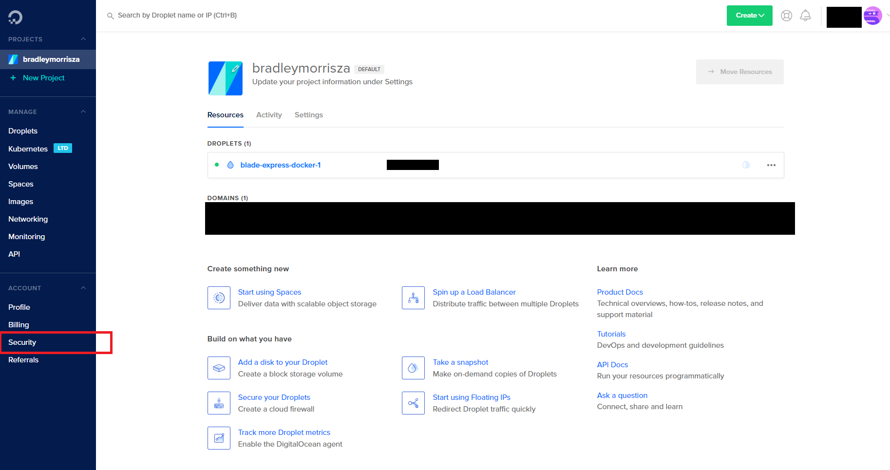

##Introduction

One of the best ways to get a project up and running and making it easy to have the project be live and testable as soon as possible
is to start development with a **Continuous Integration(CI)** pipeline.

**Continuous Integration**,from here on referred to as **CI**, is the process of having an automated process compile, test and deploy the project whenever a code change is detected in the
repository.

For the purpose of this blog I will describe how to get a simple CI pipeline up and running for a node js based project.

The technologies we'll be using are the following:

- **Github**, The popular free source control host and tooling.
- **CircleCI**, A service that you can hook into your **Github** repo that will pull the latest code changes and run them through a configurable process.
- **Docker**, Containerisation. This isn't too important to know what it is, but it helps us with keeping our deployment environment predictable and stable.
- **DockerHub**, A free store to host our **Docker** images to enable the transfer of our production code.
- **Digital Ocean**, A service that hosts Virtual Private servers that we need to host our project in the cloud.

##Step 1: Setup

What we need to setup:

- A github repo.
- Circle ci and connect to our Github repo.
- Setup a digital ocean droplet.
- A Circle ci config file (.circleci/config.yml).
- A docker image file to create our docker image for deployment.

### Github repo

For the purpose of this tutorial I'll be using the following repository I have for an existing project:

Creating a Github account, if you don't have one, and creating a repo should be pretty easy to setup.
We'll skip this setup stage.

### Connect Circle CI to our repo

First follow the steps on this page [Circle ci getting start](https://circleci.com/docs/2.0/getting-started/)

> Be sure to create the .circleci/config.yml file and push it to your repo.

Once your Github account is connected to your github repo we'll change the newly created config.yml to get our circleci workflow to build, test and deploy the project to digital ocean.
Next we'll setup an SSH key that we'll later use to connect to our Digital Ocean droplet for deployment.

### Playing with PuTTy

I assume you are using a windows machine, this tutorial will focus on developing on a windows machine, we will use a niffty app called PuTTy to generate our SSH key.

Download PuTTY from here:
[Putty](https://www.chiark.greenend.org.uk/~sgtatham/putty/latest.html)

When you have it installed go ahead and open it up.

You should see the following:

Make sure you have **SSH-2 RSA** selected on the bottom then go ahead and click **Generate**. Follow the instructions and you should see a bunch of
gibberish pop up at the top.
Like so:

Now **Save public key** and **Save private key** some where on your PC that you'll remember.

> Word of advice, give them distinguishing and descriptive names. It helps to avoid forgetting later.

Now locate your private key file and open it in a text editor(I use [Sublime Text](https://www.sublimetext.com/)).
I've generated a test key to show you.
Copy the highlighted part in the image below:

This is our **private key**. It should not be shared with anyone. We will give it to Circle CI so that it can have access to our droplet.
The top part is our public key and we will be giving that to Digital Ocean so it can verify if someone SSHing into our droplet has the rights to do so.

### Give Circle CI the private key

The next step is to copy the private key from the previous step and paste it into our SSH settings on Circle CI.

Open up Circle CI again and go to your dashboard, from here click Settings -> Projects and you should see your project there like so:

Click on the little cog icon in the top right and it will take you to the following page:

As you can see I've already added a key for DigitalOcean. You probable won't have anything there.

Just click **Add SSH Key** in the top right and a little dialog box will open with **Hostname** and **Private Key** boxes.

Enter **DigitalOcean** as the _Hostname_.
Then paste your private key you made earlier into the **Private Key** part.

Finally click **Add SSH Key** to close the dialog and save the key.

Next we need to give Digital Ocean our public key.

### Create a Digital Ocean droplet

Head on over to Digital Ocean and create an account.
Once you've logged in create a Droplet(the smallest \$5 one should be fine for the purposes of this tutorial).

> I made my Digital Ocean droplet with an Ubuntu distribution.

When you've created your droplet there is one more thing we need to do with it before we are done with Digital Ocean for now.

### Give Digital Ocean the public key

We need to create and get the SSH details to later login and deploy our docker image.

To do this go to the following page:

When you are on your dashboard you'll see your droplet there(mine is called **blade-express-docker-1**)
You now need to click on the **Securtiy** option on the sidebar near the bottom.

This will take you to the following screen:

Click on the **Add SSH Key** button on the right.
That will bring up the next popup:
